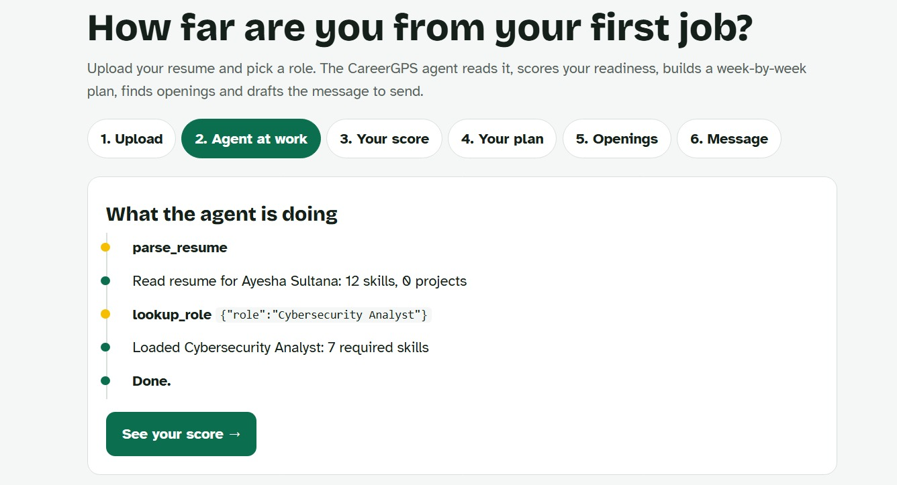
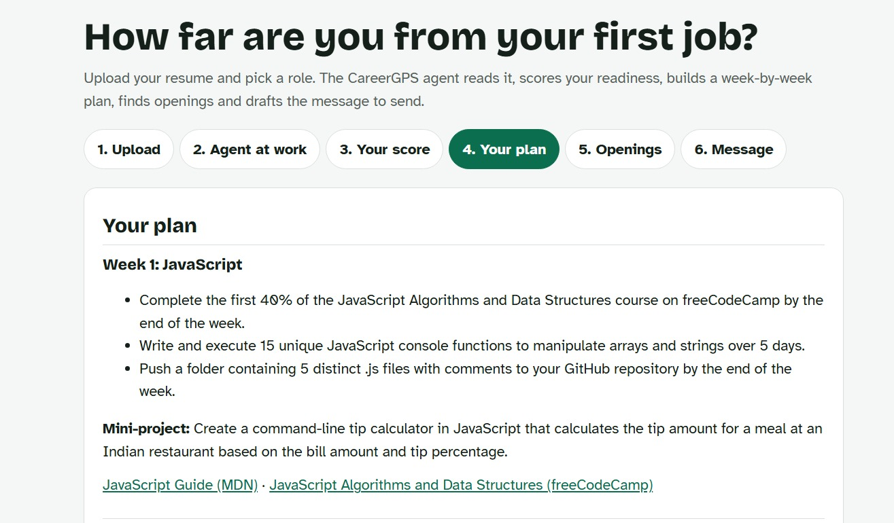

# CareerGPS Agent

**Live:** https://careergps-agent.onrender.com · **API docs:** https://careergps-agent.onrender.com/docs
**Category:** EdTech & Future Skills · BharatAgentic Hackathon

An AI agent that tells a student how far their resume is from their first job, and then acts on it: a readiness score with every point explained, a week-by-week plan, ranked openings and a message ready to send to a recruiter, in English, Hindi or Marathi.

**Documents:** [Pitch deck (PDF)](docs/CareerGPS-Agent-Pitch.pdf) · [Project documentation (PDF)](docs/CareerGPS-Agent-Documentation.pdf)

| The agent at work (live trace) | A week of the plan |
|---|---|
|  |  |

## The problem

Students at tier-2 and tier-3 colleges in India usually have no placement mentor. They can't tell how far their resume is from a real job, which skills matter most for the role they want, or what to do this week. So they apply blindly, or pay for counselling they can't afford.

## What the agent does

Upload a resume PDF, pick a target role and say how many weeks you have. The agent works through six tools and shows every step live:

| Tool | What it does |
|---|---|
| `parse_resume` | Reads the PDF and extracts education, skills, projects and experience (LLM extraction with a rule-based fallback) |
| `lookup_role` | Loads the role's required skills, with fuzzy matching ("Data Analist", "mis analyst" → Data Analyst) |
| `analyze_gaps` | Judges each required skill as matched, partial or missing, and computes the readiness score |
| `build_roadmap` | Schedules the gaps into weeks, biggest gap first, with free resources and a mini-project each week |
| `match_jobs` | Ranks openings by how much of each opening's skill list the student already has |
| `draft_outreach` | Writes a short LinkedIn or email message for the best opening, mentioning a real project from the resume |

## Why this is an agent, not a chatbot

- **The LLM chooses the tools and their order.** It writes one sentence of reasoning before each call, and the page shows it live.
- **It recovers from errors.** Tool failures go back to the model as messages ("No resume parsed yet. Call parse_resume first.", "Unknown role, did you mean…"), and it fixes the input and retries. Tests cover this.
- **It takes actions.** The result is a plan, ranked openings and a drafted message, not advice in a chat window.
- **It degrades instead of crashing.** If the model is rate-limited or fails, the agent finishes the remaining steps with rule-based versions of the same tools, so the student still gets a full result.

```
 Resume PDF + role + weeks + language
                 │
                 ▼
        ┌─────────────────┐   tool call    ┌──────────────────────────┐
        │   LLM (agent)   │ ─────────────▶ │ parse_resume             │
        │  reasons, picks │                │ lookup_role              │
        │  the next tool  │ ◀───────────── │ analyze_gaps  (score)    │
        └─────────────────┘ result / ERROR │ build_roadmap            │
                 │                         │ match_jobs               │
                 │ done (max 10 steps)     │ draft_outreach           │
                 ▼                         └──────────────────────────┘
   Score + breakdown · plan · openings · message · live trace
```

## Why the score is trustworthy

The score is computed in Python, never by the LLM, so the same resume always gets the same score and every point is shown.

- **80 points** for the role's required skills, split by importance (1 to 3, by how often employers require it). Matched = full credit, partial (a related skill, e.g. Excel for Data Visualization) = half.
- **20 points** for relevant projects: 0, 7, 13 or 20 for 0, 1, 2 or 3+ projects that use the role's skills.
- Bands: under 40 *Early stage*, under 65 *Building up*, under 85 *Nearly ready*, otherwise *Ready to apply*.

The LLM is only used where judgement or language is needed: reading messy resumes, judging ambiguous skill evidence, and writing the plan text and messages.

Sample results: strong Data Analyst resume 95, medium 52, weak resume for ML Engineer 0.

## Impact

| | Without CareerGPS Agent | With it |
|---|---|---|
| Time to know where you stand | Days or weeks waiting for a placement officer or senior, if one is available | Under a minute per resume (a full live run takes seconds) |
| Cost to the student | Paid counselling or nothing | ₹0, using free learning resources |
| Language | Mostly English-only advice | Plan and summary in English, Hindi or Marathi |
| Clarity | "Learn more skills" | Every point of the score explained, gaps ranked by importance, a dated week-by-week plan |
| Next action | Unclear | Matched openings and a drafted message to send this week |

For a college placement cell, the same API can assess a whole batch of resumes in an afternoon and show which skills the batch is weakest in.

## Responsible AI

- **The score is computed by code, not the LLM.** It is deterministic and every point is shown, so it can be checked and challenged.
- **The LLM is told not to invent anything.** Resume extraction is limited to what the resume says, and skill judgements must quote evidence from the resume.
- **No fake job claims.** Openings are labelled as sample data with fictional companies, on the results page and in the data file.
- **Privacy.** Resumes are processed per request and the temporary file is deleted straight after. No accounts and nothing stored. API keys stay on the server and are never sent to the browser or committed to the repo.
- **Graceful failure.** If the AI model fails or is rate-limited, the agent finishes with rule-based tools instead of showing a broken result. Scanned PDFs and non-PDF uploads are rejected with a clear message.
- **Honest tone.** The final summary is instructed to be honest and encouraging, never generic, and to only use numbers the tools returned.

## Tech stack

- **Backend:** Python 3.12, FastAPI, Uvicorn, Pydantic v2
- **Agent:** custom tool-calling loop (no framework) over a provider-neutral LLM wrapper
- **LLM:** Groq (Qwen / gpt-oss, OpenAI-compatible API); Anthropic Claude also supported; mock mode for offline tests
- **Resume parsing:** pdfplumber
- **Frontend:** a single HTML/CSS/JS page with no build step, live updates via server-sent events
- **Tests:** pytest (95 tests)
- **Deployment:** Docker on Render

## Run it locally

```bash
python -m venv .venv
.venv\Scripts\activate          # Mac/Linux: source .venv/bin/activate
pip install -r requirements-dev.txt
cp .env.example .env            # add your key, or set LLM_PROVIDER=mock to run offline
uvicorn app.main:app --reload
```

Open http://localhost:8000. With `LLM_PROVIDER=mock` (or no key) everything runs offline using the rule-based tools.

**LLM providers** (set in `.env`): `anthropic`, or `openai` for any OpenAI-compatible API (Groq, Gemini, OpenRouter) with `LLM_BASE_URL`. The live deployment uses Groq.

**Docker:** `docker build -t careergps-agent .` then `docker run -p 8000:8000 --env-file .env careergps-agent`

## API

| Method | Path | What |
|---|---|---|
| GET | `/health` | `{"status": "ok", "llm_mode": ...}` |
| GET | `/roles` | Supported target roles |
| POST | `/analyze` | Multipart: `resume` (PDF), `target_role`, `weeks_available` (2 to 24, default 8), `language` (`en`/`hi`/`mr`). Returns the full result as JSON |
| POST | `/analyze/stream` | Same inputs; streams each agent step as server-sent events, then the result |

```bash
curl -X POST https://careergps-agent.onrender.com/analyze \
  -F resume=@tests/samples/medium_data_analyst.pdf \
  -F target_role="Data Analyst" -F weeks_available=6
```

Errors: non-PDF upload → 415, over 10 MB → 413, invalid role/weeks/language → 422.

## Tests

```bash
LLM_PROVIDER=mock pytest -q      # PowerShell: $env:LLM_PROVIDER="mock"; pytest -q
```

95 tests, no API key or network needed. They cover parsing, role lookup, scoring (order, determinism, breakdown sums), the roadmap, matching, outreach, the agent's error recovery and the API.

## Data and limits

- **Roles:** 8 entry-level roles (Data Analyst, Data Scientist, ML Engineer, Backend, Frontend, Full-Stack, Cybersecurity Analyst, Business Analyst) with weighted skills and free learning resources (Kaggle Learn, freeCodeCamp, MDN, NPTEL and others).
- **Openings are sample data:** 20 openings with fictional companies. Production would connect a jobs API.
- **Scanned PDFs are rejected** with a clear message; OCR is a next step.
- **Privacy:** resumes are processed per request and the temporary file is deleted straight after. Nothing is stored.

## Next steps

- Connect a live jobs API in place of the sample openings
- OCR for scanned resumes
- Plug the agent into the CareerGPS platform so plans and progress are saved to the student's account
- Batch reports for placement cells (skill gaps across a whole class)
- More roles and more Indian languages

## Path to adoption

CareerGPS is already live as a student platform (https://careergps-alpha.vercel.app) with accounts, a syllabus reader, skill checks and a mentor chat. This agent becomes its core engine, and is offered B2B to college placement cells to assess whole batches.

## Team

- Aarvi Dalvi
- Aalia Khan
- Ayesha Sultana
